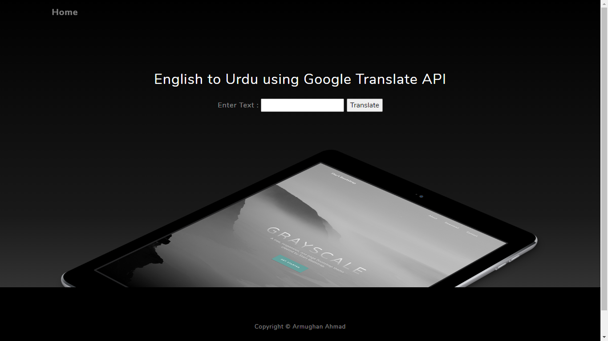

# Urdu Translation using Google Translation within flask

In this flask application, i am using a free bootstrap built web template and then i am simply getting an input from the user and then using the Google Translate API to translate user's input to Urdu.

## Simple FrontEnd
